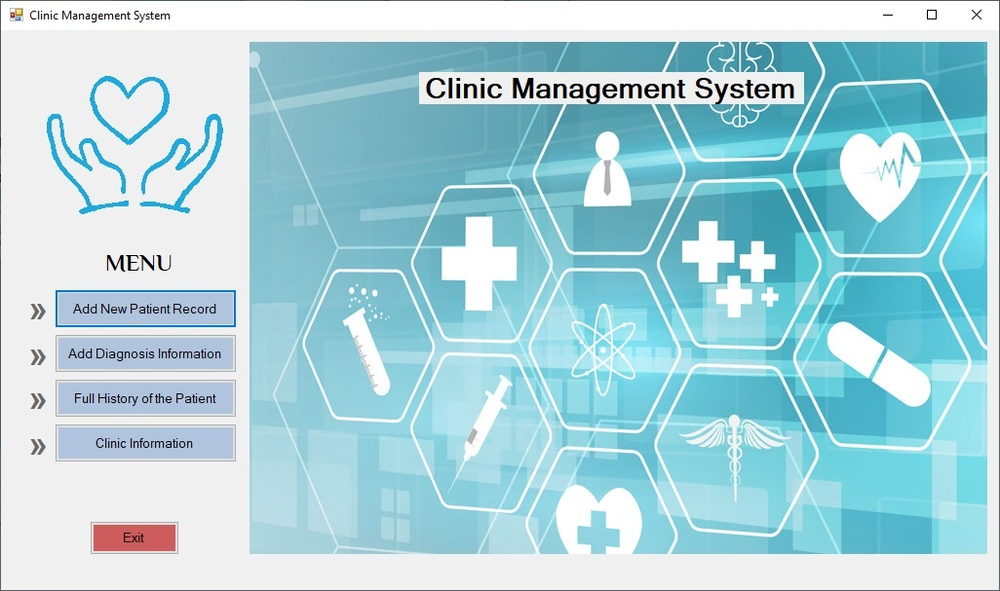
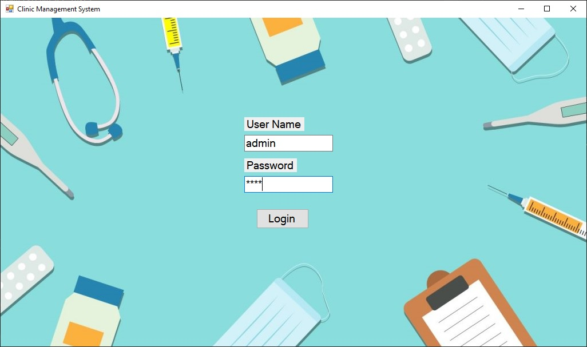

# ClinicManagementSystem
C# winform application using MS SQL Server. Clinic Management System is an application used for managing the activities of a Clinic such as Enrolling a Patient, Patient Diagnosis Details, Full History of a Patient etc. 

